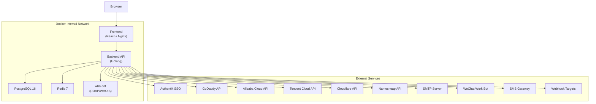
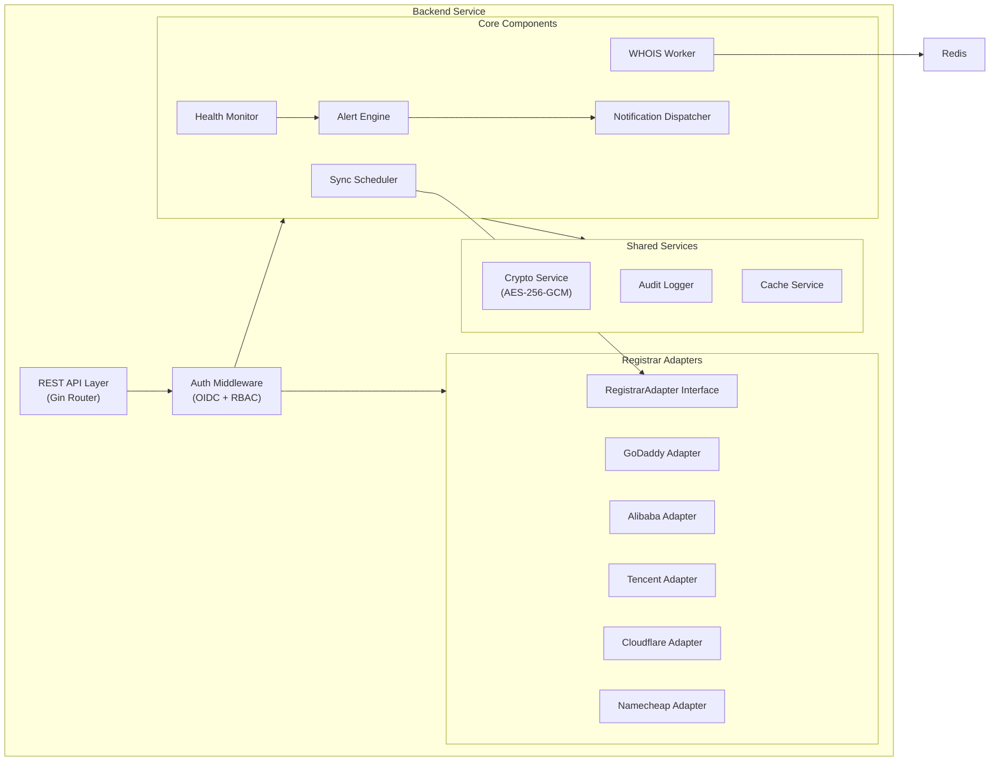
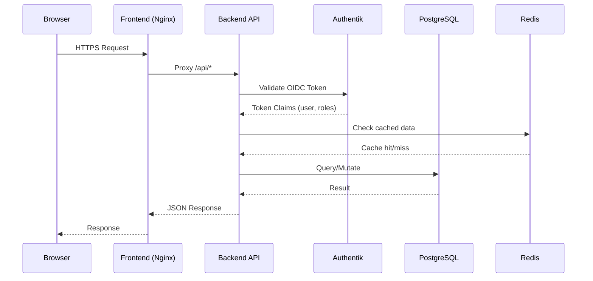
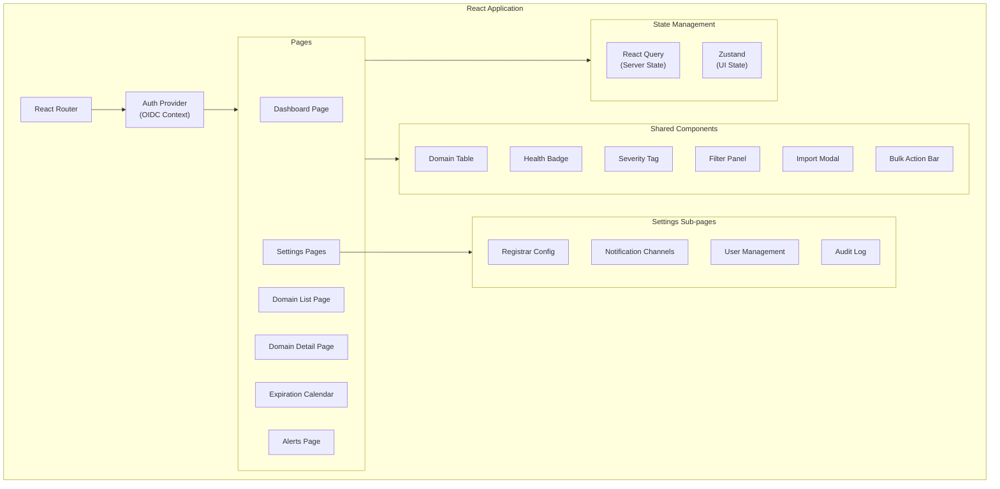
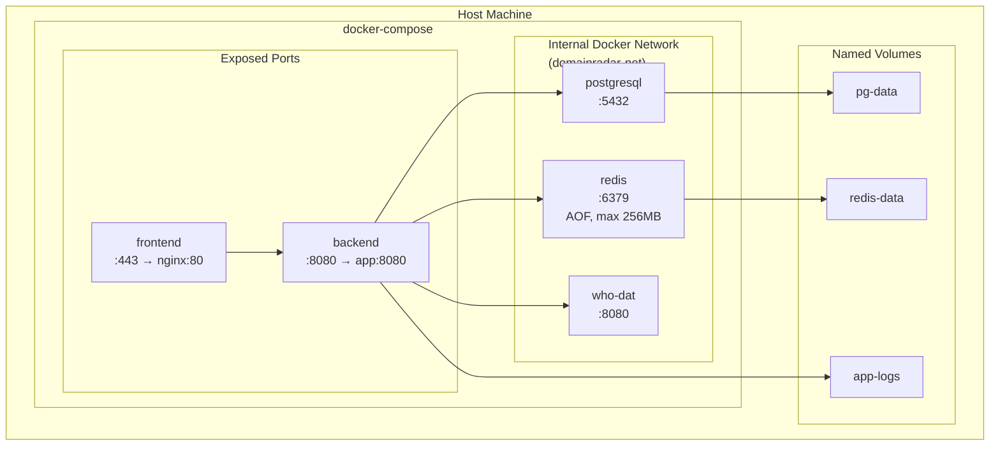
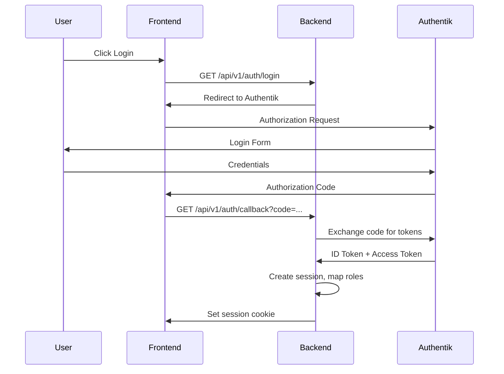

# Design Document: DomainRadar

## Overview

DomainRadar is a centralized domain asset management system designed to unify domain monitoring across multiple registrars (GoDaddy, Alibaba Cloud, Tencent Cloud, Cloudflare, Namecheap, Xinnet, etc.). The system provides a single pane of glass for tracking domain expiration, website availability, HTTPS certificate health, and email service compliance.

**Key Design Goals:**
- Plugin-based registrar adapter architecture for extensible multi-registrar support
- Tiered monitoring frequency that scales with expiration proximity
- Multi-channel alerting with configurable severity-to-channel mapping
- Full Docker containerization for consistent deployment
- Secure credential storage with database-level encryption (no environment variable secrets)
- Authentik SSO integration with RBAC for team collaboration

**Technology Stack:**
| Layer | Technology |
|-------|-----------|
| Backend API | Go (Golang) with Gin/Echo HTTP framework |
| Frontend | React + TypeScript with Ant Design Pro |
| Database | PostgreSQL 16 |
| Queue/Cache | Redis 7 (AOF persistence) |
| WHOIS Lookup | who-dat (self-hosted Docker, RDAP+WHOIS) |
| Authentication | Authentik SSO via OIDC |
| Containerization | Docker + docker-compose |
| Reverse Proxy | Nginx (frontend container) |

## Architecture

### High-Level System Architecture



### Internal Component Architecture



### Request Flow



## Components and Interfaces

### 1. Registrar Adapter Interface

The adapter pattern allows adding new registrars without modifying core logic.

```go
// RegistrarAdapter defines the contract for all registrar integrations
type RegistrarAdapter interface {
    // ListDomains retrieves all active domains from the registrar account
    ListDomains(ctx context.Context, credential *RegistrarCredential) ([]NormalizedDomain, error)
    
    // GetDomainDetail retrieves detailed info for a specific domain
    GetDomainDetail(ctx context.Context, credential *RegistrarCredential, domainName string) (*NormalizedDomain, error)
    
    // TestConnection validates that credentials are working
    TestConnection(ctx context.Context, credential *RegistrarCredential) error
    
    // RegistrarType returns the identifier for this adapter
    RegistrarType() string
}

// AdapterRegistry manages all available registrar adapters
type AdapterRegistry struct {
    adapters map[string]RegistrarAdapter
}

func (r *AdapterRegistry) Register(adapter RegistrarAdapter) {
    r.adapters[adapter.RegistrarType()] = adapter
}

func (r *AdapterRegistry) Get(registrarType string) (RegistrarAdapter, error) {
    adapter, ok := r.adapters[registrarType]
    if !ok {
        return nil, fmt.Errorf("unsupported registrar type: %s", registrarType)
    }
    return adapter, nil
}
```

### 2. Sync Scheduler

Orchestrates periodic domain data synchronization with smart frequency scheduling.

```go
type SyncScheduler struct {
    db              *gorm.DB
    redis           *redis.Client
    adapterRegistry *AdapterRegistry
    cryptoService   *CryptoService
    logger          *zap.Logger
}

// SyncFrequencyTier determines sync interval based on expiration proximity
type SyncFrequencyTier int

const (
    TierFarExpiry   SyncFrequencyTier = iota // >90 days: weekly
    TierMedExpiry                             // 30-90 days: daily
    TierNearExpiry                            // <30 days: every 12h
)

func (s *SyncScheduler) CalculateSyncInterval(expiresAt time.Time) time.Duration {
    daysUntilExpiry := time.Until(expiresAt).Hours() / 24
    switch {
    case daysUntilExpiry > 90:
        return 168 * time.Hour // weekly
    case daysUntilExpiry > 30:
        return 24 * time.Hour // daily
    default:
        return 12 * time.Hour // every 12h
    }
}

// RunSyncCycle executes a full sync for a registrar account
func (s *SyncScheduler) RunSyncCycle(ctx context.Context, accountID uint) error
```

### 3. WHOIS Worker

Queue-based worker processing rate-limited WHOIS lookups via who-dat.

```go
type WHOISWorker struct {
    redis       *redis.Client
    db          *gorm.DB
    whoDatURL   string // default: http://who-dat:8080
    rateLimiter *rate.Limiter // 2 req/sec
    logger      *zap.Logger
}

// WHOISQueryJob represents a job in the Redis queue
type WHOISQueryJob struct {
    DomainID   uint   `json:"domain_id"`
    DomainName string `json:"domain_name"`
    Retries    int    `json:"retries"`
    NextRetry  int64  `json:"next_retry"` // unix timestamp
}

// QueryDomain calls who-dat API and parses the response
func (w *WHOISWorker) QueryDomain(ctx context.Context, domain string) (*WHOISResult, error)

// ProcessQueue continuously processes the WHOIS query queue
func (w *WHOISWorker) ProcessQueue(ctx context.Context) error

// CalculateQueryInterval returns the interval based on expiration proximity
func (w *WHOISWorker) CalculateQueryInterval(expiresAt time.Time) time.Duration {
    daysUntilExpiry := time.Until(expiresAt).Hours() / 24
    switch {
    case daysUntilExpiry > 90:
        return 7 * 24 * time.Hour // weekly
    case daysUntilExpiry > 30:
        return 24 * time.Hour // daily
    default:
        return 12 * time.Hour // every 12h
    }
}
```

### 4. Alert Engine

Evaluates alert rules against monitored assets and generates alerts.

```go
type AlertEngine struct {
    db         *gorm.DB
    dispatcher *NotificationDispatcher
    logger     *zap.Logger
}

type AlertSeverity string

const (
    SeverityInformational AlertSeverity = "informational" // 90-31 days
    SeverityWarning       AlertSeverity = "warning"       // 30-8 days
    SeverityCritical      AlertSeverity = "critical"      // 7-0 days
    SeverityExpired       AlertSeverity = "expired"       // past due
)

func (e *AlertEngine) CalculateSeverity(daysRemaining int, autoRenew bool) AlertSeverity {
    // Base severity from proximity
    var severity AlertSeverity
    switch {
    case daysRemaining < 0:
        severity = SeverityExpired
    case daysRemaining <= 7:
        severity = SeverityCritical
    case daysRemaining <= 30:
        severity = SeverityWarning
    default:
        severity = SeverityInformational
    }
    // Escalate if auto-renew disabled and within 30 days
    if !autoRenew && daysRemaining <= 30 && severity == SeverityWarning {
        severity = SeverityCritical
    }
    return severity
}

// RunExpirationCheck evaluates all domains and generates alerts
func (e *AlertEngine) RunExpirationCheck(ctx context.Context) error
```

### 5. Notification Dispatcher

Delivers alert notifications across multiple channels.

```go
type NotificationDispatcher struct {
    db            *gorm.DB
    cryptoService *CryptoService
    channels      map[string]NotificationChannel
    logger        *zap.Logger
}

// NotificationChannel is the interface for all delivery channels
type NotificationChannel interface {
    Send(ctx context.Context, notification *Notification) error
    TestConnection(ctx context.Context, config *ChannelConfig) error
    ChannelType() string
}

// Implementations: EmailChannel, WeChatWorkChannel, SMSChannel, WebhookChannel

type WebhookPayload struct {
    AlertSeverity string    `json:"alert_severity"`
    AlertType     string    `json:"alert_type"`
    TriggeredAt   time.Time `json:"triggered_at"`
    DomainName    string    `json:"domain_name"`
    DomainURL     string    `json:"domain_url"`
    Message       string    `json:"message"`
}
```

### 6. Health Monitor

Performs periodic checks on websites, certificates, and email services.

```go
type HealthMonitor struct {
    db          *gorm.DB
    redis       *redis.Client
    alertEngine *AlertEngine
    logger      *zap.Logger
}

// WebsiteCheck performs HTTP health check
func (h *HealthMonitor) CheckWebsite(ctx context.Context, domain *Domain) (*HealthCheckResult, error)

// CertificateCheck retrieves and validates SSL/TLS certificate
func (h *HealthMonitor) CheckCertificate(ctx context.Context, domain *Domain) (*CertificateResult, error)

// EmailCheck validates MX, SPF, DKIM, DMARC records
func (h *HealthMonitor) CheckEmailService(ctx context.Context, domain *Domain) (*EmailCheckResult, error)

// CalculateHealthScore computes 0-100 health score
func (h *HealthMonitor) CalculateHealthScore(domain *Domain) int {
    // Expiration proximity: 30 points
    // Certificate validity: 25 points
    // Website uptime: 25 points
    // Email compliance: 20 points
}

// CalculateEmailComplianceScore computes 0-100 email score
func (h *HealthMonitor) CalculateEmailComplianceScore(result *EmailCheckResult) int {
    // MX presence: 25 points
    // SPF validity: 25 points
    // DKIM validity: 25 points
    // DMARC validity: 25 points
}
```

### 7. Crypto Service

Handles encryption/decryption of sensitive credentials stored in the database.

```go
type CryptoService struct {
    masterKey []byte // loaded from secure env at startup only
}

// Encrypt encrypts plaintext using AES-256-GCM
func (c *CryptoService) Encrypt(plaintext string) (string, error)

// Decrypt decrypts ciphertext using AES-256-GCM
func (c *CryptoService) Decrypt(ciphertext string) (string, error)

// MaskCredential returns last 4 characters with prefix masked
func (c *CryptoService) MaskCredential(value string) string {
    if len(value) <= 4 {
        return "****"
    }
    return strings.Repeat("*", len(value)-4) + value[len(value)-4:]
}
```

### REST API Design

#### Authentication & Users
| Method | Path | Description |
|--------|------|-------------|
| GET | /api/v1/auth/login | Initiate OIDC login flow |
| GET | /api/v1/auth/callback | OIDC callback handler |
| POST | /api/v1/auth/logout | Logout and invalidate session |
| GET | /api/v1/auth/me | Get current user info |
| GET | /api/v1/users | List users (admin) |
| PUT | /api/v1/users/:id/roles | Update user roles |

#### Domains
| Method | Path | Description |
|--------|------|-------------|
| GET | /api/v1/domains | List domains (paginated, filterable) |
| GET | /api/v1/domains/:id | Get domain detail |
| POST | /api/v1/domains | Create manual domain |
| PUT | /api/v1/domains/:id | Update domain |
| DELETE | /api/v1/domains/:id | Delete domain |
| POST | /api/v1/domains/import | Import CSV/Excel |
| POST | /api/v1/domains/bulk | Bulk operations |
| GET | /api/v1/domains/export | Export domains |
| GET | /api/v1/domains/calendar | Expiration calendar data |

#### Registrars
| Method | Path | Description |
|--------|------|-------------|
| GET | /api/v1/registrars | List configured registrars |
| POST | /api/v1/registrars | Add registrar config |
| PUT | /api/v1/registrars/:id | Update registrar config |
| DELETE | /api/v1/registrars/:id | Delete registrar config |
| POST | /api/v1/registrars/:id/test | Test connectivity |
| POST | /api/v1/registrars/:id/sync | Trigger manual sync |
| GET | /api/v1/registrars/:id/status | Get sync status & errors |

#### Alerts & Notifications
| Method | Path | Description |
|--------|------|-------------|
| GET | /api/v1/alerts | List alerts (filterable) |
| GET | /api/v1/alerts/:id | Get alert detail |
| PUT | /api/v1/alerts/:id/acknowledge | Acknowledge alert |
| GET | /api/v1/notifications/channels | List notification channels |
| POST | /api/v1/notifications/channels | Create channel config |
| PUT | /api/v1/notifications/channels/:id | Update channel config |
| DELETE | /api/v1/notifications/channels/:id | Delete channel config |
| POST | /api/v1/notifications/channels/:id/test | Test channel |
| GET | /api/v1/notifications/rules | List notification rules |
| POST | /api/v1/notifications/rules | Create notification rule |
| PUT | /api/v1/notifications/rules/:id | Update rule |
| DELETE | /api/v1/notifications/rules/:id | Delete rule |

#### Monitoring
| Method | Path | Description |
|--------|------|-------------|
| GET | /api/v1/monitoring/websites/:domainId | Get website health history |
| GET | /api/v1/monitoring/certificates/:domainId | Get certificate info |
| GET | /api/v1/monitoring/email/:domainId | Get email compliance |
| GET | /api/v1/monitoring/uptime/:domainId | Get uptime stats |

#### Dashboard & Reports
| Method | Path | Description |
|--------|------|-------------|
| GET | /api/v1/dashboard | Get dashboard summary |
| GET | /api/v1/dashboard/health-scores | Get health scores |
| GET | /api/v1/reports/costs | Get cost statistics |

#### Tags & Groups
| Method | Path | Description |
|--------|------|-------------|
| GET | /api/v1/tags | List all tags |
| POST | /api/v1/tags | Create tag |
| DELETE | /api/v1/tags/:id | Delete tag |
| GET | /api/v1/groups | List groups (hierarchical) |
| POST | /api/v1/groups | Create group |
| PUT | /api/v1/groups/:id | Update group |
| DELETE | /api/v1/groups/:id | Delete group |

#### System
| Method | Path | Description |
|--------|------|-------------|
| GET | /api/v1/system/health | Health check endpoint |
| GET | /api/v1/audit-logs | List audit logs (admin) |

## Data Models

### PostgreSQL Schema

```mermaid
erDiagram
    domains ||--o{ domain_tags : has
    domains ||--o{ health_checks : has
    domains ||--o{ certificate_checks : has
    domains ||--o{ email_checks : has
    domains ||--o{ alerts : triggers
    domains }o--|| groups : belongs_to
    domains }o--|| registrar_accounts : synced_from
    registrar_accounts }o--|| registrar_configs : belongs_to
    alerts ||--o{ notification_logs : generates
    notification_channels ||--o{ notification_rules : configures
    users ||--o{ user_roles : has
    users ||--o{ audit_logs : performs

    domains {
        bigint id PK
        varchar domain_name UK
        bigint registrar_account_id FK
        varchar registrar_identifier
        timestamp creation_date
        timestamp expiration_date
        boolean auto_renew
        timestamp renewal_deadline
        varchar status
        text nameservers
        boolean privacy_protection
        boolean lock_status
        varchar data_source_type
        timestamp last_sync_at
        bigint group_id FK
        text notes
        varchar website_url
        boolean email_enabled
        int health_score
        int check_interval_minutes
        int response_time_threshold_ms
        timestamp created_at
        timestamp updated_at
    }

    registrar_configs {
        bigint id PK
        varchar registrar_type
        varchar display_name
        timestamp created_at
        timestamp updated_at
    }

    registrar_accounts {
        bigint id PK
        bigint registrar_config_id FK
        varchar account_name
        text credentials_encrypted
        varchar status
        int sync_interval_hours
        timestamp last_sync_at
        int domain_count
        timestamp created_at
        timestamp updated_at
    }

    groups {
        bigint id PK
        varchar name
        bigint parent_id FK
        int level
        timestamp created_at
    }

    tags {
        bigint id PK
        varchar name UK
        timestamp created_at
    }

    domain_tags {
        bigint domain_id FK
        bigint tag_id FK
    }

    health_checks {
        bigint id PK
        bigint domain_id FK
        int http_status_code
        int response_time_ms
        boolean ssl_valid
        timestamp ssl_expiry
        text redirect_chain
        varchar check_type
        varchar failure_category
        text failure_detail
        timestamp checked_at
    }

    certificate_checks {
        bigint id PK
        bigint domain_id FK
        varchar issuer
        varchar subject
        timestamp valid_from
        timestamp valid_to
        boolean chain_complete
        varchar serial_number
        int days_remaining
        timestamp checked_at
    }

    email_checks {
        bigint id PK
        bigint domain_id FK
        text mx_records
        boolean spf_valid
        boolean dkim_valid
        boolean dmarc_valid
        int compliance_score
        text mx_previous
        boolean mx_changed
        timestamp checked_at
    }

    alerts {
        bigint id PK
        bigint domain_id FK
        varchar alert_type
        varchar severity
        varchar message
        int days_remaining
        boolean acknowledged
        varchar delivery_status
        timestamp generated_at
        timestamp acknowledged_at
    }

    notification_channels {
        bigint id PK
        varchar channel_type
        varchar name
        text config_encrypted
        varchar status
        timestamp last_tested_at
        timestamp created_at
        timestamp updated_at
    }

    notification_rules {
        bigint id PK
        bigint domain_id FK
        bigint channel_id FK
        varchar severity_filter
        timestamp created_at
    }

    notification_logs {
        bigint id PK
        bigint alert_id FK
        bigint channel_id FK
        varchar status
        text error_reason
        int retry_count
        timestamp sent_at
        timestamp created_at
    }

    users {
        bigint id PK
        varchar external_id UK
        varchar email
        varchar display_name
        timestamp last_login_at
        timestamp created_at
        timestamp updated_at
    }

    user_roles {
        bigint id PK
        bigint user_id FK
        varchar role
        timestamp created_at
    }

    audit_logs {
        bigint id PK
        bigint user_id FK
        varchar action_type
        varchar resource_type
        varchar resource_id
        jsonb changed_fields
        timestamp created_at
    }

    sync_logs {
        bigint id PK
        bigint registrar_account_id FK
        timestamp started_at
        timestamp ended_at
        int domains_synced
        int domains_updated
        varchar status
        text error_message
    }
}
```

### Key Data Model Definitions (Go structs)

```go
// NormalizedDomain is the unified domain representation
type NormalizedDomain struct {
    ID                  uint           `gorm:"primaryKey"`
    DomainName          string         `gorm:"uniqueIndex;size:253"`
    RegistrarAccountID  *uint          `gorm:"index"`
    RegistrarIdentifier string         `gorm:"size:100"`
    CreationDate        *time.Time
    ExpirationDate      *time.Time     `gorm:"index"`
    AutoRenew           bool
    RenewalDeadline     *time.Time
    Status              string         `gorm:"size:50;default:'active'"`
    Nameservers         pq.StringArray `gorm:"type:text[]"`
    PrivacyProtection   bool
    LockStatus          bool
    DataSourceType      string         `gorm:"size:20"` // "api", "whois", "manual"
    LastSyncAt          *time.Time
    GroupID             *uint          `gorm:"index"`
    Notes               string         `gorm:"type:text"`
    WebsiteURL          string         `gorm:"size:2048"`
    EmailEnabled        bool
    HealthScore         int            `gorm:"default:100"`
    CheckIntervalMin    int            `gorm:"default:5"`
    ResponseThresholdMs int            `gorm:"default:10000"`
    CreatedAt           time.Time
    UpdatedAt           time.Time
    
    // Relations
    Tags               []Tag          `gorm:"many2many:domain_tags"`
    Group              *Group         `gorm:"foreignKey:GroupID"`
    RegistrarAccount   *RegistrarAccount `gorm:"foreignKey:RegistrarAccountID"`
}

// RegistrarAccount holds encrypted credentials for one registrar account
type RegistrarAccount struct {
    ID                 uint      `gorm:"primaryKey"`
    RegistrarConfigID  uint      `gorm:"index"`
    AccountName        string    `gorm:"size:100"`
    CredentialsEncrypted string  `gorm:"type:text"` // AES-256-GCM encrypted JSON
    Status             string    `gorm:"size:20"` // "connected", "disconnected", "error"
    SyncIntervalHours  int       `gorm:"default:24"`
    LastSyncAt         *time.Time
    DomainCount        int       `gorm:"default:0"`
    CreatedAt          time.Time
    UpdatedAt          time.Time
}

// Alert represents a generated alert
type Alert struct {
    ID             uint          `gorm:"primaryKey"`
    DomainID       uint          `gorm:"index"`
    AlertType      string        `gorm:"size:50"` // "expiration", "certificate", "downtime", "email", "dns"
    Severity       AlertSeverity `gorm:"size:20"`
    Message        string        `gorm:"type:text"`
    DaysRemaining  *int
    Acknowledged   bool          `gorm:"default:false"`
    DeliveryStatus string        `gorm:"size:20"` // "pending", "delivered", "failed", "undelivered"
    GeneratedAt    time.Time     `gorm:"index"`
    AcknowledgedAt *time.Time
}
```

### Frontend Architecture



**Frontend State Management:**
- **React Query** (TanStack Query): All server state (domains, alerts, monitoring data). Handles caching, background refetch, optimistic updates, and pagination.
- **Zustand**: Local UI state (filter selections, sidebar collapse, theme preference).

**Key Frontend Libraries:**
| Library | Purpose |
|---------|---------|
| React 18+ | UI framework |
| TypeScript | Type safety |
| Ant Design Pro | Component library + layout |
| TanStack Query | Server state management |
| Zustand | Client state |
| React Router v6 | Routing |
| Recharts | Charts & uptime graphs |
| FullCalendar | Expiration calendar |
| Papa Parse | CSV parsing |
| xlsx | Excel parsing |

## Docker Deployment Architecture



**Container Specifications:**

| Service | Base Image | Max Size | Health Check | Restart Policy |
|---------|-----------|----------|-------------|---------------|
| backend | golang (build) → alpine (run) | 100MB | `GET /api/v1/system/health` | unless-stopped (prod), no (dev) |
| frontend | node (build) → nginx:alpine (run) | 50MB | `GET /health` (nginx) | unless-stopped (prod), no (dev) |
| postgresql | postgres:16-alpine | - | `pg_isready` | unless-stopped |
| redis | redis:7-alpine | - | `redis-cli ping` | unless-stopped |
| who-dat | lissy93/who-dat | - | `GET /health` | unless-stopped |

**Startup Order:** PostgreSQL, Redis → who-dat → Backend → Frontend

**docker-compose.yml structure:**
```yaml
version: "3.8"
services:
  postgresql:
    image: postgres:16-alpine
    volumes: [pg-data:/var/lib/postgresql/data]
    healthcheck:
      test: pg_isready -U domainradar
      interval: 30s
      start_period: 60s
    networks: [domainradar-net]

  redis:
    image: redis:7-alpine
    command: redis-server --appendonly yes --maxmemory 256mb --maxmemory-policy allkeys-lru
    volumes: [redis-data:/data]
    healthcheck:
      test: redis-cli ping
      interval: 30s
      start_period: 60s
    networks: [domainradar-net]

  who-dat:
    image: lissy93/who-dat
    dns: [8.8.8.8, 8.8.4.4]
    healthcheck:
      test: wget -q --spider http://localhost:8080/health || exit 1
      interval: 30s
      start_period: 60s
    depends_on:
      postgresql: { condition: service_healthy }
    networks: [domainradar-net]

  backend:
    build:
      context: ./backend
      target: production
    depends_on:
      postgresql: { condition: service_healthy }
      redis: { condition: service_healthy }
      who-dat: { condition: service_healthy }
    healthcheck:
      test: wget -q --spider http://localhost:8080/api/v1/system/health || exit 1
      interval: 30s
      start_period: 60s
    networks: [domainradar-net]
    ports: ["8080:8080"]
    volumes: [app-logs:/app/logs]

  frontend:
    build:
      context: ./frontend
      target: production
    depends_on:
      backend: { condition: service_healthy }
    healthcheck:
      test: wget -q --spider http://localhost:80/health || exit 1
      interval: 30s
      start_period: 60s
    networks: [domainradar-net]
    ports: ["443:80"]

networks:
  domainradar-net:
    driver: bridge

volumes:
  pg-data:
  redis-data:
  app-logs:
```

## Security Design

### Credential Encryption

All registrar API credentials and notification channel secrets are encrypted at rest using AES-256-GCM:

1. **Master Key**: A 32-byte encryption key loaded from an environment variable (`DOMAINRADAR_MASTER_KEY`) at application startup. This is the only secret stored outside the database.
2. **Encryption**: Each credential value is encrypted with a unique nonce before storage.
3. **API Responses**: Credentials are never returned in plaintext. All API responses mask credentials showing only the last 4 characters.
4. **Audit Logs**: Credential values are always masked in audit log entries.

### Authentication Flow (OIDC with Authentik)



### Role-Based Access Control

| Permission | Viewer | Operator | Admin |
|-----------|--------|----------|-------|
| View domains | Yes | Yes | Yes |
| View alerts | Yes | Yes | Yes |
| Manage domains (CRUD) | No | Yes | Yes |
| Acknowledge alerts | No | Yes | Yes |
| Configure registrars | No | No | Yes |
| Configure notifications | No | No | Yes |
| Manage users & roles | No | No | Yes |
| View audit logs | No | No | Yes |
| System configuration | No | No | Yes |

### Audit Logging

Every create, update, and delete operation records:
- `user_id`: The authenticated user
- `action_type`: CREATE, UPDATE, DELETE
- `resource_type`: domain, registrar, alert, user, etc.
- `resource_id`: The affected resource identifier
- `changed_fields`: JSON diff of before/after values (with credentials masked)
- `created_at`: Timestamp with timezone

Retention: Minimum 365 days. Older logs can be archived to cold storage.

## Correctness Properties

*A property is a characteristic or behavior that should hold true across all valid executions of a system — essentially, a formal statement about what the system should do. Properties serve as the bridge between human-readable specifications and machine-verifiable correctness guarantees.*

### Property 1: Sync frequency tier assignment

*For any* domain with a known expiration date, the calculated sync interval SHALL be:
- 168 hours (±1h) when expiration is more than 90 days away
- 24 hours (±30min) when expiration is 30-90 days away
- 12 hours (±30min) when expiration is fewer than 30 days away

This property applies to both API sync (Sync_Scheduler) and WHOIS query (WHOIS_Worker) frequency calculations.

**Validates: Requirements 2.5, 12.1, 12.2, 12.3**

### Property 2: Sync interval override clamping

*For any* administrator-configured sync interval override value, the system SHALL clamp the interval to the valid range [1 hour, 30 days]. Values below 1 hour are raised to 1 hour; values above 30 days are lowered to 30 days.

**Validates: Requirements 1.6, 12.4**

### Property 3: Domain data merge preserves user-defined fields

*For any* domain record with existing user-defined fields (tags, notes, group assignment), when the Sync_Scheduler or WHOIS_Worker updates the domain with new data from an external source, the user-defined fields SHALL remain unchanged while API-sourced fields are updated.

**Validates: Requirements 1.5, 13.4**

### Property 4: Domain removal requires two consecutive absences

*For any* domain present in the local database, it SHALL be marked as "unverified-removed" if and only if it is absent from the registrar API response in two consecutive successful sync cycles. A single absence SHALL NOT change the domain's status.

**Validates: Requirements 1.8**

### Property 5: Alert severity assignment

*For any* domain with a known days-remaining-until-expiration value and auto-renew status, the assigned severity SHALL be:
- "expired" when days remaining < 0
- "critical" when days remaining is 0-7
- "warning" when days remaining is 8-30
- "informational" when days remaining is 31-90
- Additionally, if auto-renew is disabled AND days remaining ≤ 30, severity SHALL be escalated by one level (warning → critical)

This applies to both domain and certificate expiration alerting.

**Validates: Requirements 4.3, 4.4, 7.3**

### Property 6: Alert threshold evaluation completeness

*For any* domain that crosses a configured alert threshold (default: 90, 30, 14, 7, 3, 1 day before expiration), the generated alert record SHALL contain all required fields: domain name, registrar, expiration date, days remaining, and the correct severity level.

**Validates: Requirements 4.1, 4.2**

### Property 7: Credential encryption round-trip

*For any* credential string, encrypting it with AES-256-GCM and then decrypting SHALL return the original string. Additionally, the encrypted ciphertext SHALL NOT contain the plaintext as a substring.

**Validates: Requirements 11.2**

### Property 8: Credential masking format

*For any* credential string of length N where N > 4, the masked output SHALL be exactly (N-4) asterisk characters followed by the last 4 characters of the original. For strings of length ≤ 4, the output SHALL be "****".

**Validates: Requirements 5.3, 11.3**

### Property 9: WHOIS exponential backoff timing

*For any* retry attempt number N (0-indexed, max 2), the WHOIS_Worker backoff delay SHALL be 2^(N+1) seconds (2s for first retry, 4s for second, 8s for third). After 3 failed retries, the query SHALL be marked as failed.

**Validates: Requirements 2.3**

### Property 10: Notification delivery exponential backoff

*For any* notification retry attempt number N (0-indexed, max 2), the Notification_Dispatcher backoff delay SHALL be 5 × 2^N seconds (5s, 10s, 20s).

**Validates: Requirements 5.4**

### Property 11: Health check downtime detection

*For any* sequence of consecutive health check results for a website, a downtime alert SHALL be generated if and only if 3 or more consecutive checks fail (non-2xx status OR response time exceeds threshold).

**Validates: Requirements 6.3**

### Property 12: Uptime percentage calculation

*For any* set of health check results over a time period, the uptime percentage SHALL equal (successful_checks / total_checks) × 100, rounded to two decimal places.

**Validates: Requirements 6.5**

### Property 13: Health check failure categorization

*For any* health check failure, the categorization SHALL be:
- "dns" if the failure is due to DNS resolution error
- "connectivity" if the failure is due to connection timeout or network error (non-DNS)
- "http_error" if the failure is due to non-2xx status code

These categories SHALL be mutually exclusive and exhaustive for all failure types.

**Validates: Requirements 6.6, 6.7**

### Property 14: Website downtime duration calculation

*For any* sequence of health check state transitions from "unavailable" to "available", the reported downtime duration SHALL equal the time elapsed between the first failed check in the downtime period and the first successful check that ends it.

**Validates: Requirements 6.4**

### Property 15: Email compliance score calculation

*For any* domain's email check results, the compliance score SHALL equal: (MX_present × 25) + (SPF_valid × 25) + (DKIM_valid × 25) + (DMARC_valid × 25), where each boolean is treated as 0 or 1, producing a score in [0, 100].

**Validates: Requirements 8.5**

### Property 16: Domain health score calculation

*For any* domain, the overall health score SHALL be a weighted sum: expiration_score(30) + certificate_score(25) + uptime_score(25) + email_score(20), producing a value in [0, 100].

**Validates: Requirements 9.3**

### Property 17: CSV/Excel import validation

*For any* CSV/Excel file with a mix of valid and invalid rows, the system SHALL: create Normalized_Domain records for all valid rows, report row-level errors for invalid rows (with row number, field name, reason), and the sum of (records_created + records_updated + error_rows) SHALL equal the total rows processed.

**Validates: Requirements 3.2, 3.6**

### Property 18: Export data round-trip

*For any* set of domain records (including tags and group memberships), exporting to CSV and parsing the output SHALL produce records containing all original domain fields, tags, and group assignments.

**Validates: Requirements 9.4, 13.6**

### Property 19: WHOIS expiration discrepancy detection

*For any* manually entered domain with both a manual expiration date and a WHOIS-retrieved expiration date, a discrepancy SHALL be flagged if and only if the absolute difference between the two dates exceeds 24 hours.

**Validates: Requirements 2.6**

### Property 20: who-dat circuit breaker state transitions

*For any* sequence of health check results for the who-dat service, the WHOIS_Worker SHALL:
- Pause all queries after exactly 3 consecutive failed health checks (at 30-second intervals)
- Resume queries on the first successful health check after being paused

**Validates: Requirements 2.9**

### Property 21: Notification severity-to-channel routing

*For any* generated alert with a specific severity level, the Notification_Dispatcher SHALL deliver notifications to exactly those channels configured for that severity level in the notification rules.

**Validates: Requirements 5.2, 5.5**

### Property 22: Webhook payload completeness

*For any* alert dispatched to a Webhook channel, the JSON payload SHALL contain all required fields: alert_severity, alert_type, triggered_at (timestamp), domain_name, and domain_url.

**Validates: Requirements 5.6**

### Property 23: RBAC enforcement

*For any* combination of user role and API endpoint, the system SHALL return HTTP 403 if and only if the role does not have the required permission for that endpoint. Access decisions SHALL be consistent with the defined permission matrix.

**Validates: Requirements 10.4**

### Property 24: Certificate renewal detection

*For any* pair of consecutive certificate checks for the same domain, a renewal event SHALL be detected if and only if the valid-to date OR serial number has changed. Upon detection, all active certificate alerts for that domain SHALL be cleared.

**Validates: Requirements 7.6**

### Property 25: Certificate critical alert generation

*For any* certificate validation result showing an invalid chain, hostname mismatch, or revocation status, the system SHALL generate a critical-severity alert regardless of the certificate's expiration date.

**Validates: Requirements 7.4**

### Property 26: MX record change detection

*For any* two consecutive MX record check results for the same domain, a warning alert SHALL be generated if and only if the MX record sets differ.

**Validates: Requirements 8.4**

### Property 27: Tag and group constraint enforcement

*For any* domain, the system SHALL enforce: maximum 20 tags per domain, tag names between 1-50 characters, and group hierarchy depth maximum of 3 levels. Operations exceeding these limits SHALL be rejected.

**Validates: Requirements 13.1, 13.2**

### Property 28: Domain list filtering correctness

*For any* set of domains and any combination of filter criteria (tags, groups, registrar, status, expiration date range), the returned results SHALL include all and only those domains that match ALL specified filter criteria.

**Validates: Requirements 13.3**

### Property 29: Registrar configuration validation

*For any* registrar configuration input, the system SHALL accept it if and only if all required fields are non-empty AND all credential values are ≤ 512 characters. The maximum of 20 accounts per registrar type SHALL be enforced.

**Validates: Requirements 11.4, 11.8**

### Property 30: Audit log completeness

*For any* create, update, or delete operation performed by an authenticated user, the audit log entry SHALL contain: user_id, action_type, resource_type, resource_id, timestamp, and changed_fields (with credentials masked).

**Validates: Requirements 10.3**

### Property 31: Sync error resilience

*For any* set of existing domain records in the local database, if a registrar API sync cycle fails (error or unreachable), all existing records SHALL remain unchanged after the failed cycle.

**Validates: Requirements 1.7**

## Error Handling

### Error Categories and Recovery Strategies

| Error Category | Source | Strategy | User Impact |
|---------------|--------|----------|-------------|
| Registrar API Error | Sync Scheduler | Retry next scheduled cycle; retain existing data | None (stale data persists) |
| Registrar API Timeout | Sync Scheduler | Abort cycle; retain existing data; alert admin | Admin notification |
| who-dat Unreachable | WHOIS Worker | Circuit breaker (pause after 3 failures); auto-resume | WHOIS queries deferred |
| who-dat Rate Limited (429) | WHOIS Worker | Exponential backoff (2s, 4s, 8s); max 3 retries | Individual query delayed |
| Notification Delivery Failure | Notification Dispatcher | Exponential backoff (5s, 10s, 20s); max 3 retries | Alert marked as failed |
| Critical Alert Undelivered | Notification Dispatcher | Flag in dashboard; reattempt after 5 minutes | Admin dashboard flag |
| DNS Resolution Failure | Health Monitor | Categorize as DNS issue; alert with detail | DNS-specific alert |
| Connection Timeout | Health Monitor | Categorize as connectivity; 3 consecutive = downtime | Downtime alert after 3 |
| Certificate Retrieval Failure | Health Monitor | Log failure; retry next scheduled check | No immediate alert |
| CSV/Excel Parse Error | Import Service | Row-level errors; continue processing valid rows | Error summary report |
| Authentication Failure | Auth Middleware | Return 401; redirect to login | Re-authentication required |
| Authorization Failure | RBAC Middleware | Return 403; log attempt | Access denied message |
| Database Connection Lost | All Components | Connection pool retry; circuit breaker | 503 during outage |
| Redis Connection Lost | Queue/Cache | Fallback to direct processing; no caching | Degraded performance |

### Error Response Format

All API errors follow a consistent JSON format:

```json
{
  "error": {
    "code": "REGISTRAR_SYNC_FAILED",
    "message": "Failed to sync domains from GoDaddy account 'production'",
    "details": {
      "registrar": "godaddy",
      "account_id": 12,
      "reason": "API returned 503 Service Unavailable"
    },
    "request_id": "req_abc123"
  }
}
```

### Circuit Breaker Pattern

Used for external service dependencies (who-dat, registrar APIs, notification channels):

```
States: CLOSED → OPEN → HALF_OPEN → CLOSED
- CLOSED: Normal operation, requests pass through
- OPEN: After N consecutive failures, all requests fail fast
- HALF_OPEN: After cooldown period, allow one test request
  - Success → CLOSED
  - Failure → OPEN (reset cooldown)
```

**Configuration per service:**
| Service | Failure Threshold | Cooldown | Health Check Interval |
|---------|-------------------|----------|----------------------|
| who-dat | 3 consecutive | 90 seconds | 30 seconds |
| Registrar APIs | 5 consecutive | 5 minutes | Per sync schedule |
| Notification Channels | 3 consecutive | 60 seconds | On-demand |

### Graceful Degradation

When dependent services are unavailable:
1. **Database down**: All write operations fail; cached reads may still serve dashboard
2. **Redis down**: Queue operations fall back to synchronous processing; caching disabled
3. **who-dat down**: WHOIS queries paused; API-synced and manual domains unaffected
4. **Notification channel down**: Alerts still generated and stored; delivery retried

## Testing Strategy

### Testing Approach

DomainRadar uses a dual testing approach:
- **Property-based tests**: Verify universal correctness properties across all valid inputs using generated test data
- **Unit tests**: Verify specific examples, edge cases, and component interactions
- **Integration tests**: Verify external service interactions and end-to-end flows

### Property-Based Testing

**Library**: [rapid](https://github.com/flyingmutant/rapid) (Go property-based testing library)

**Configuration**:
- Minimum 100 iterations per property test
- Each test tagged with design property reference
- Tag format: `Feature: domain-radar, Property {N}: {title}`

**Properties to implement** (referencing design document properties above):

| Property | Component Under Test | Generator Strategy |
|----------|---------------------|-------------------|
| 1: Sync frequency tier | `SyncScheduler.CalculateSyncInterval` | Random time.Time for expiration dates |
| 2: Interval override clamping | `SyncScheduler.ClampInterval` | Random time.Duration values |
| 3: Merge preserves user fields | `SyncScheduler.MergeDomainData` | Random NormalizedDomain pairs |
| 4: Two consecutive absences | `SyncScheduler.EvaluateRemovals` | Random domain ID sets across sync cycles |
| 5: Alert severity | `AlertEngine.CalculateSeverity` | Random (int, bool) pairs |
| 6: Alert completeness | `AlertEngine.GenerateAlert` | Random domain + threshold inputs |
| 7: Encryption round-trip | `CryptoService.Encrypt/Decrypt` | Random UTF-8 strings |
| 8: Credential masking | `CryptoService.MaskCredential` | Random strings of varying length |
| 9: WHOIS backoff | `WHOISWorker.CalculateBackoff` | Random retry counts 0-2 |
| 10: Notification backoff | `NotificationDispatcher.CalculateBackoff` | Random retry counts 0-2 |
| 11: Downtime detection | `HealthMonitor.EvaluateDowntime` | Random sequences of check results |
| 12: Uptime percentage | `HealthMonitor.CalculateUptime` | Random check result arrays |
| 13: Failure categorization | `HealthMonitor.CategorizeFailure` | Random error types |
| 14: Downtime duration | `HealthMonitor.CalculateDowntimeDuration` | Random timestamp sequences |
| 15: Email compliance score | `HealthMonitor.CalculateEmailScore` | Random boolean quadruples |
| 16: Health score | `HealthMonitor.CalculateHealthScore` | Random component score tuples |
| 17: Import validation | `ImportService.ValidateRows` | Random CSV row data |
| 18: Export round-trip | `ExportService.Export` + Parse | Random domain slices with tags |
| 19: WHOIS discrepancy | `WHOISWorker.CheckDiscrepancy` | Random date pairs |
| 20: Circuit breaker | `CircuitBreaker.RecordResult` | Random boolean sequences |
| 21: Severity routing | `NotificationDispatcher.RouteAlert` | Random (severity, rule set) pairs |
| 22: Webhook payload | `NotificationDispatcher.BuildWebhookPayload` | Random alert objects |
| 23: RBAC enforcement | `RBACMiddleware.CheckPermission` | Random (role, endpoint) pairs |
| 24: Certificate renewal | `HealthMonitor.DetectRenewal` | Random certificate check pairs |
| 25: Cert critical alert | `HealthMonitor.ValidateCertificate` | Random cert validation results |
| 26: MX change detection | `HealthMonitor.DetectMXChange` | Random MX record set pairs |
| 27: Tag/group constraints | `DomainService.ValidateTagsGroups` | Random tag/group inputs |
| 28: Filter correctness | `DomainService.FilterDomains` | Random (domain set, filter criteria) |
| 29: Registrar config validation | `RegistrarService.ValidateConfig` | Random config inputs |
| 30: Audit log completeness | `AuditService.RecordAction` | Random CUD operations |
| 31: Sync error resilience | `SyncScheduler.HandleSyncError` | Random (domain set, error) pairs |

### Unit Testing

**Framework**: Go standard `testing` package + [testify](https://github.com/stretchr/testify) for assertions

**Focus areas**:
- Specific edge cases (empty strings, zero-length arrays, boundary values)
- Integration points between components (mocked dependencies)
- Error handling paths
- HTTP handler request/response validation
- Database query correctness (using test database)

### Integration Testing

**Framework**: Go `testing` + [testcontainers-go](https://github.com/testcontainers/testcontainers-go)

**Scope**:
- Full sync cycle with mocked registrar APIs
- WHOIS query processing with mocked who-dat
- Notification delivery with mocked channels
- OIDC authentication flow with mocked Authentik
- Database migrations and schema validation
- Docker health check verification
- End-to-end API tests through the full stack

### Frontend Testing

**Framework**: Vitest + React Testing Library + Playwright (E2E)

**Scope**:
- Component rendering with various props (Vitest + RTL)
- Form validation and submission flows
- Filter and search interactions
- Dashboard data display
- E2E user journeys (login → view domains → acknowledge alert)

### Test Organization

```
backend/
├── internal/
│   ├── sync/
│   │   ├── scheduler.go
│   │   ├── scheduler_test.go        # unit tests
│   │   └── scheduler_prop_test.go   # property tests
│   ├── alert/
│   │   ├── engine.go
│   │   ├── engine_test.go
│   │   └── engine_prop_test.go
│   ├── monitor/
│   │   ├── health.go
│   │   ├── health_test.go
│   │   └── health_prop_test.go
│   └── ...
├── integration/
│   ├── sync_integration_test.go
│   ├── whois_integration_test.go
│   └── notification_integration_test.go
frontend/
├── src/
│   ├── components/
│   │   └── __tests__/
│   ├── pages/
│   │   └── __tests__/
│   └── ...
├── e2e/
│   └── journeys/
```


