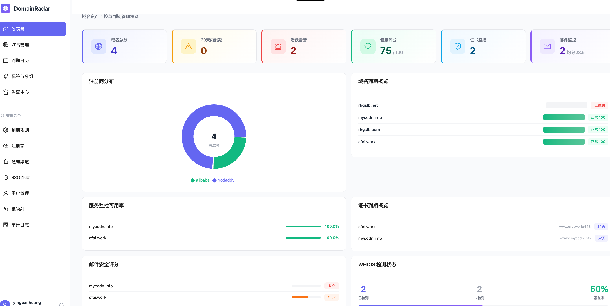
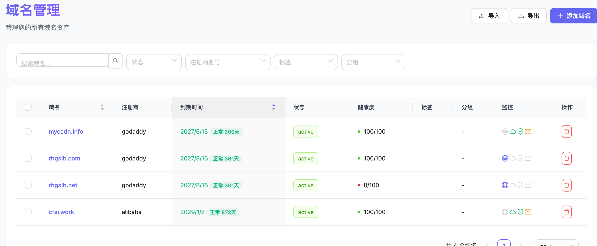
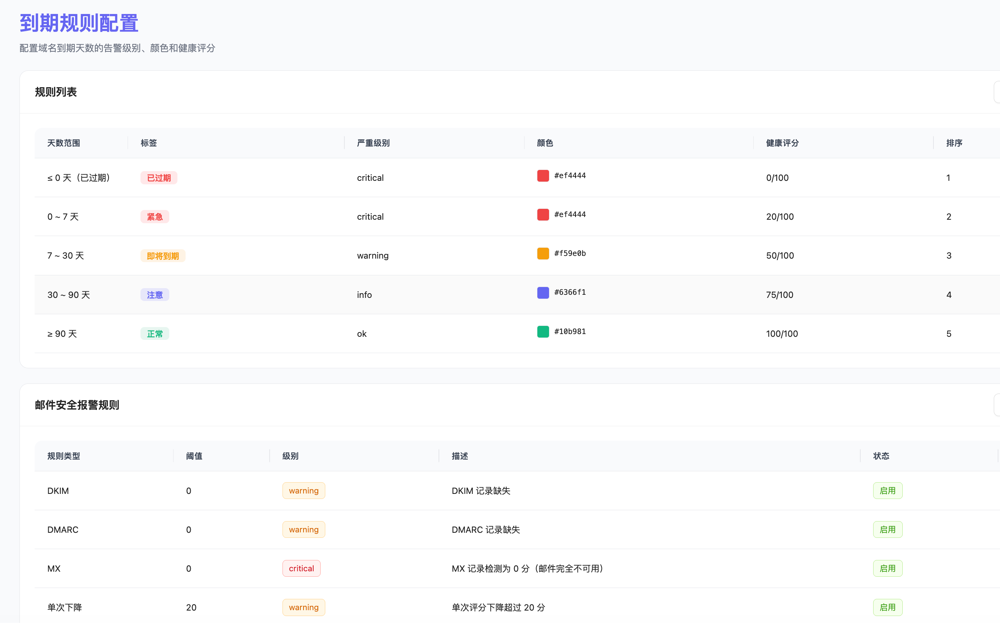
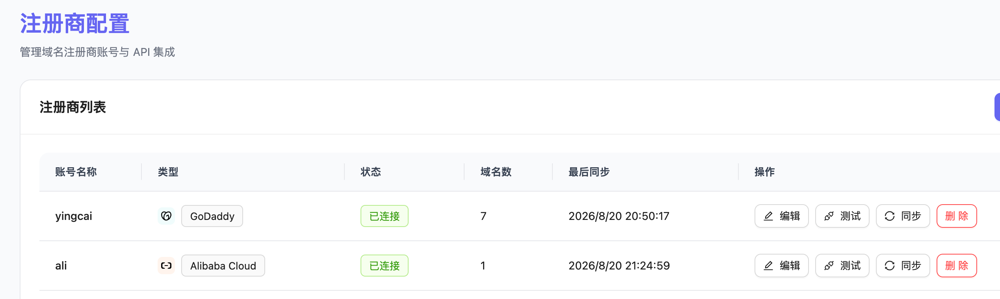
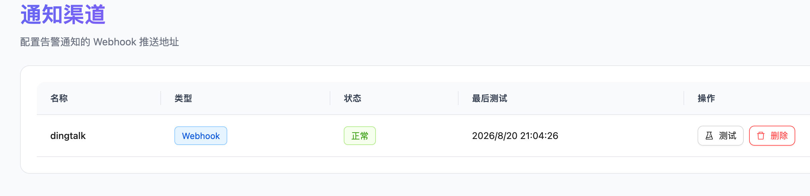

# DomainRadar

域名资产监控与到期管理平台

## 平台截图

| 仪表盘 | 域名管理 |
|:---:|:---:|
|  |  |

| 到期规则 | 注册商配置 |
|:---:|:---:|
|  |  |

| 通知渠道 |
|:---:|
|  |

## 功能概览

- 域名管理 — 多注册商（GoDaddy、阿里云、腾讯云、Cloudflare、Namecheap）API 同步
- 到期监控 — 域名到期预警、健康评分、可配置告警规则
- 证书监控 — SSL/TLS 证书检测、证书链分析、到期提醒
- 邮件安全 — MX/SPF/DKIM/DMARC/PTR/MTA-STS/TLSRPT/BIMI 全面检测评分
- 服务监控 — TCP/UDP/HTTP/HTTPS 探测、响应时间趋势、可用率统计
- WHOIS 检测 — 每日自动 WHOIS 更新、注册信息变更告警
- Webhook 通知 — 钉钉/企业微信/飞书/Slack 自动推送告警
- SSO 认证 — OIDC 单点登录 + 本地用户名密码认证
- Dashboard — 全局概览、注册商分布、评分排名、监控状态

## 技术栈

- 前端: React 19 + Ant Design 5 + Recharts + React Query
- 后端: Go + Gin + GORM + PostgreSQL
- 缓存: Redis 7
- WHOIS: who-dat (lissy93/who-dat)
- 反代: Caddy 2（自动 HTTPS）
- 容器: Docker Compose

## 快速部署

### 环境要求

- Docker Engine 24+
- Docker Compose v2+
- 2GB+ 内存

### 本地开发/测试

```bash
# 克隆代码
git clone https://github.com/yingcaihuang/DomainRadar.git
cd DomainRadar

# 使用默认配置启动（HTTP 端口 80）
docker compose -f docker-compose.prod.yml --env-file .env.production up --build -d

# 访问
open http://localhost
```

默认管理员账号:

| 字段 | 值 |
|------|-----|
| 用户名 | admin |
| 密码 | admin123 |
| 角色 | 管理员 |

> 首次登录后会强制要求修改密码。仅在数据库中无任何用户时自动创建。

### 生产部署

```bash
# 1. 配置环境变量
cp .env.production .env
vi .env
```

编辑 .env，取消注释并设置域名:

```
# 站点域名（Caddy 自动申请 Let's Encrypt SSL 证书）
SITE_DOMAIN=domainradar.verycloud.cn

# 修改数据库密码
POSTGRES_PASSWORD=your_secure_password

# 修改加密密钥（必须 32 字节）
DOMAINRADAR_MASTER_KEY=your_32_byte_random_key_here!!!
```

```bash
# 2. 确保 DNS 已解析到服务器
dig domainradar.verycloud.cn

# 3. 启动服务
docker compose -f docker-compose.prod.yml --env-file .env up --build -d

# 4. 查看状态
docker compose -f docker-compose.prod.yml ps

# 5. 查看日志
docker compose -f docker-compose.prod.yml logs -f caddy
```

首次启动 Caddy 会自动申请 SSL 证书，约 30 秒后可通过 HTTPS 访问。

### 环境对比

| 环境 | .env 中 SITE_DOMAIN | 访问地址 | SSL |
|------|---------------------|----------|-----|
| 本地测试 | 留空或注释（默认 :80） | http://localhost | 无 |
| 生产部署 | domainradar.verycloud.cn | https://domainradar.verycloud.cn | 自动 |

### 服务端口

| 服务 | 内部端口 | 外部端口 |
|------|----------|----------|
| Caddy（反代） | 80/443 | 80/443 |
| Backend API | 8080 | 不暴露 |
| PostgreSQL | 5432 | 不暴露 |
| Redis | 6379 | 不暴露 |
| who-dat | 8080 | 不暴露 |

### Caddy 说明

Caddyfile 使用环境变量 {$SITE_DOMAIN::80}:

- 未设置 SITE_DOMAIN 时默认为 :80（纯 HTTP，适合本地开发）
- 设为域名时 Caddy 自动启用 HTTPS + Let's Encrypt 证书自动续期
- 支持 HTTP/2 + HTTP/3 (QUIC)

### 使用预构建镜像部署（推荐）

无需克隆源码，直接使用 GitHub Container Registry 的预构建镜像：

```bash
# 下载部署文件
curl -O https://raw.githubusercontent.com/yingcaihuang/DomainRadar/main/docker-compose.ghcr.yml
curl -O https://raw.githubusercontent.com/yingcaihuang/DomainRadar/main/.env.production

# 配置环境
cp .env.production .env
vi .env  # 设置 SITE_DOMAIN 和密码

# 启动
docker compose -f docker-compose.ghcr.yml --env-file .env up -d
```

镜像地址：
- `ghcr.io/yingcaihuang/domainradar-backend:latest`
- `ghcr.io/yingcaihuang/domainradar-caddy:latest`

### 常用命令

```bash
# 启动
docker compose -f docker-compose.prod.yml --env-file .env up -d

# 停止
docker compose -f docker-compose.prod.yml down

# 重建单个服务
docker compose -f docker-compose.prod.yml up --build -d backend

# 查看日志
docker compose -f docker-compose.prod.yml logs -f backend

# 备份数据库
docker exec domainradar-postgresql pg_dump -U domainradar domainradar > backup.sql

# 恢复数据库
cat backup.sql | docker exec -i domainradar-postgresql psql -U domainradar domainradar
```

## 初始配置

1. 登录 — 使用默认管理员 admin / admin123，首次登录需修改密码
2. 添加注册商 — 设置 > 注册商，添加 GoDaddy/阿里云/腾讯云的 API 凭据
3. 同步域名 — 点击"同步"，选择要导入的域名，可按标签/分组批量管理
4. 配置监控 — 进入域名详情，添加证书端点、邮件监控、服务探针
5. 设置通知 — 设置 > 通知渠道，添加钉钉/企业微信 Webhook
6. SSO（可选） — 设置 > SSO 配置，配置 OIDC 提供商

## 故障排查

### API 请求返回 308 重定向

现象：前端页面能正常打开，但所有 `/api/*` 请求返回 `308 Permanent Redirect`，`Location` 与请求 URL 完全相同。

原因：宿主机的 `~/.docker/config.json` 配置了 `proxies`，Docker 会向每个新建容器注入 `HTTP_PROXY` 环境变量。Caddy 2.7+ 的 `reverse_proxy` 默认读取该变量，导致回源 `backend:8080` 的请求被发往转发代理，而 Caddy 默认保留原始 `Host` 头，转发代理据此做强制 HTTPS 跳转。

排查：

```bash
# 确认容器是否被注入代理变量
docker exec domainradar-caddy env | grep -i proxy

# 查看 Caddy 实际生成的路由树，确认配置本身没问题
docker exec domainradar-caddy caddy adapt --config /etc/caddy/Caddyfile
```

修复：compose 文件已为 backend 和 caddy 设置 `NO_PROXY`，排除内网服务名。外网访问（ACME 签证书、注册商 API、WHOIS 查询）仍走代理。

### API 请求返回前端 HTML 或 405

原因：Caddyfile 指令顺序问题。Caddy 有固定的指令执行顺序，`try_files` 排在 `reverse_proxy` 之前，会先把 `/api/xxx` 重写成 `/index.html`，导致 `reverse_proxy` 的路径匹配器失效。

修复：使用两个互斥的 `handle` 块，而不是在同一层级混用 `reverse_proxy` 和 `try_files`。当前 Caddyfile 已采用此结构。

## License

MIT
